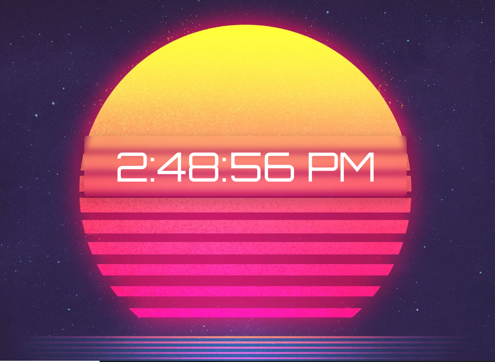

# Getting Started with Create React App

This project was bootstrapped with [Create React App](https://github.com/facebook/create-react-app).

# SynthWave Clock

This is a basic clock app used to tell current time.
built with React and JavaScript. styled with CSS.

# npm start

Runs the app in the development mode.
Open http://localhost:3000 to view it in your browser.

